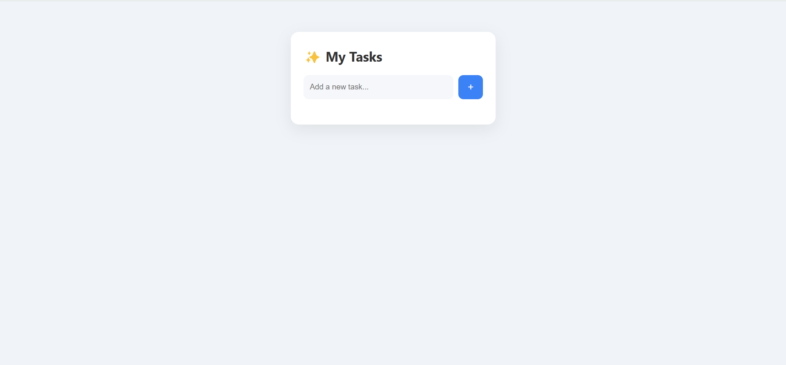

✅ Modern JavaScript To-Do List

A stylish, minimal, and user-friendly To-Do List application built using plain JavaScript, HTML, CSS, and the browser's Local Storage for data persistence.

🚀 Features

Add new tasks

Mark tasks as completed

Delete tasks

Tasks persist even after refreshing the browser (using Local Storage)

Clean, modern user interface

🎨 Built With

HTML5: Structured the content.

CSS3: Modern styling, responsive layout.

JavaScript: Interactive functionality, DOM manipulation, and Local Storage.

📁 Project Structure

todo-app/
├── index.html
├── style.css
└── script.js

💻 How to Run Locally

Clone the repository:

git clone https://github.com/Ordnarycoder/To-do-List-With-Local-Storage-51.git

Open index.html in your browser:

todo-app/index.html

📝 Usage

Type your task into the input box.

Press Enter or click the + button to add the task.

Click the task text to toggle between completed and incomplete.

Click the ✕ button next to a task to delete it.

🌟 Demo

📌 Future Improvements

Add task categories or tags

Implement due dates and reminders

Dark mode toggle

🤝 Contributing

Feel free to fork this project and submit a pull request with improvements or additional features!

📄 License

This project is open source and available for educational purposes.

